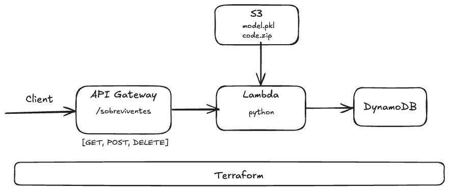

# Titanic Survival API

API serverless para predição de sobrevivência de passageiros do Titanic, usando AWS Lambda + API Gateway + DynamoDB, provisionada com Terraform.

## Arquitetura



## Deploy

### 1. Clone o repositório

```bash
git clone <repo>
```

### 2. Configure as credenciais AWS

```bash
aws configure
# ou exporte: AWS_ACCESS_KEY_ID, AWS_SECRET_ACCESS_KEY, AWS_DEFAULT_REGION
```

### 3. Build e deploy completo

```bash
make deploy
```

Isso vai:
1. Compilar a Lambda com numpy/pandas/scikit-learn em um zip
2. Executar `terraform init` + `terraform apply`
3. Fazer upload do `model.pkl` e `lambda.zip` para S3
4. Criar Lambda, DynamoDB, API Gateway e IAM roles

### 4. Testar

```bash
make test
```

Ou manualmente:

```bash
python lambda/app_local.py

# Escorar um passageiro
curl -X POST "http://localhost:5555/sobreviventes" \
  -H "Content-Type: application/json" \
  -d '{
   "resource": "/sobreviventes",
   "path": "/sobreviventes",
   "httpMethod": "POST",
    "body": "{\"passengers\": [{\"id\": \"01\", \"pclass\": 1, \"sex\": \"male\", \"age\": 29, \"sibsp\": 0, \"parch\": 0, \"fare\": 211.3, \"embarked\": \"C\"}]}"
  }'

# Listar todos os dados
curl "http://localhost:5555/sobreviventes" \
  -H "Content-Type: application/json" \
  -d '{
   "path":"/sobreviventes/10",
   "httpMethod":"GET"
  }'

# Listar pode ID
curl "http://localhost:5555/sobreviventes/01" \
  -H "Content-Type: application/json" \
  -d '{
   "path":"/sobreviventes/10",
   "httpMethod":"GET",
   "pathParameters":{
      "id":"01"
    }
  }'

# Deletar passageiro
curl -X DELETE "http://localhost:5555/sobreviventes/01" \
  -H "Content-Type: application/json" \
  -d '{
   "path":"/sobreviventes/10",
   "httpMethod":"DELETE",
   "pathParameters":{
      "id":"01"
    }
  }'
```

## Endpoints

> URL Temporária: https://nesi8yy7ad.execute-api.us-east-2.amazonaws.com/dev/sobreviventes

| Método | Path | Descrição |
|---|---|---|
| `POST` | `/sobreviventes` | Escorar um ou mais passageiros |
| `GET` | `/sobreviventes` | Listar todos os passageiros avaliados |
| `GET` | `/sobreviventes/{id}` | Consultar passageiro por ID |
| `DELETE` | `/sobreviventes/{id}` | Remover passageiro |

### Exemplo de request (POST)

```json
{
  "passengers": [
    {
      "id": "01", #opcional
      "pclass": 3,
      "sex": "male",
      "age": 22,
      "sibsp": 1,
      "parch": 0,
      "fare": 7.25,
      "embarked": "Q"
    }
  ]
}
```

### Exemplo de response (POST)

```json
{
  "results": [
    {
      "id": "001",
      "survived": 0,
      "predict_proba": 0.4832123
    }
  ]
}
```

## Estrutura do repositório

```
├── lambda
│   ├── app_local.py          # API Flask Local
│   ├── lambda_function.py    # Código da Lambda
│   ├── requests_local.http   # Requisições Local
│   ├── requirements.txt      # Dependências Python
│   └── treinamento.ipynb     # Notebook de treinamento
├── model
│   └── model.pkl             # Modelo Treinado
├── openapi
│   └── openapi.yaml          # Contrato OpenAPI
├── terraform
│   ├── api_gateway.tf        # Infra API Gatewau
│   ├── dynamodb.tf           # Infra Database
│   ├── iam.tf                # Infra IAM
│   ├── lambda.tf             # Infra Lambda
│   ├── main.tf               # Provider
│   ├── outputs.tf            # Output dos recursos criados
│   ├── s3.tf                 # Infra S3
│   └── variables.tf          # Variáveis configuráveis
├── .gitignore
├── Makefile                  # Comando de build, deploy e test
└── README.md
```

## Destruir a infraestrutura

```bash
make destroy
```
